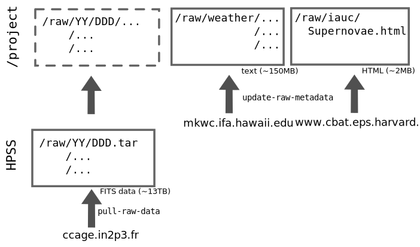

Pipeline 2.0
============

*Experimental next-gen Nearby Supernova Factory pipeline*

Raw Data
--------

- **Instrument Data:** Located on HPSS in tar files, with one tar file per
  night of data.  Files are found in
  `/nersc/projects/snfactry/raw/YY/DDD.tar` and can be unpacked with
  the htar command. Files were copied from CC. Note that there are
  occasionally extra junk files on HPSS that do not exist at CC. HPSS
  should contain a superset of the files at the CC.

- **Weather:** Weather data from Mauna Kea Weather Center is used. Files
  are synced from a public site to `/project/projectdirs/snfactry/raw/weather`
  using wget.

- **IAU Names:** The public HTML page at
  http://www.cbat.eps.harvard.edu/lists/Supernovae.html is synced to
  `/project/projectdirs/snfactry/raw/iauc`.

Scripts
-------

Run `<cmd> -h` or `<cmd> --help` for usage info for each script.

- `check-raw-data`: Checks that all files at CC are present on HPSS.
- `pull-raw-data`: Pull files from CC to HPSS.
- `update-raw-metadata`: Sync weather and IAU webpages to local locations.
